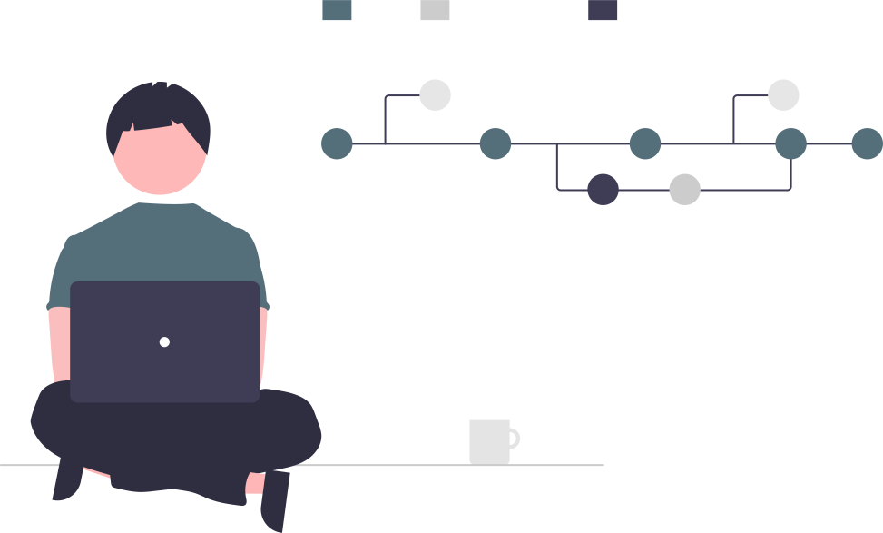

<!-- Thin image banner strip -->

  

<!-- Text support strip -->

 <strong>We Stand With Palestine — Freedom, Dignity, and Justice for All</strong>

 
<h1 align="center">
  
</h1>

   
   
  <b>CEO @ TheGreatTech</b> | Full-Stack Developer | Tech Community Architect

--- 

## 🚀 Professional Overview

  
  
  - 💼 Founder & CEO of [TheGreatTech](https://thegreattech.tech) - Award-winning development agency
  - 🌐 Creator of [MCA Community](https://mca.free.nf) - 500+ member developer collective
  - 📚 Curator of [BCA/MCA Resources](https://maqsoodhussain.github.io/mca)
  - 🏅 GitHub Certified Developer | CS50 Alumni
  - 📫 Contact: [maqsood@thegreattech.tech](mailto:maqsood@thegreattech.tech) / [themaqsoodhussainwani@gmail.com](mailto:themaqsoodhussainwani@gmail.com)
  - 📱 Whatsapp [whatsapp](https://wa.me/+917889528326)
  - <a href="tel:+923001234567">📞 +91 7889528326</a>

  **"Engineering digital solutions that drive business growth"**

---

## � GitHub Foundation Certification

  <h3>Official Certification Badge</h3>
  
   
  <i>Validated expertise in GitHub workflows and collaboration</i>

---

## 💻 Technical Expertise

### Core Development Stack

  
  
  
  
  

### Web & Mobile Technologies

  
  
  
  

---

## 🌟 Project Portfolio
### Enterprise Solutions

|  |  |  |  |
|-----------------------------------------------------------------------------------------------------------------------------|------------------------------------------------------------------------------------------------------------------|-----------------------------------------------------------------------------------------------------|--------------------------------------------------------------------------------------------------------------------------|
| [**Applause Kashmir**](https://www.applausekashmir.in/) | [**Pursukoon Villa**](https://pursukoonvilla.in) | [**WCW Society**](https://wcwsociety.org.in) | [**Stress Out Tours**](https://stressouttours.com) |

### Educational Resources
- [📘 ALP Study Notes](https://maqsoodhussain.github.io/emunotes/)
- [📚 Data Structures Masterclass](https://github.com/maqsoodhussain/Data-Structure-Notes)
- [🎓 MCA Syllabus Portal](https://maqsoodhussain.github.io/mca)

### Experimental Projects
| [🎮 Tic Tac Toe](https://maqsoodhussain.github.io/Tic-Tac-Toe/) | [💡 Smart Bulb](https://maqsoodhussain.github.io/blubonoff/) | [📄 Interactive CV](https://maqsoodhussain.github.io/resume/) |
|----------------------------------------------------------------|-------------------------------------------------------------|-------------------------------------------------------------|

---

## 📊 GitHub Analytics

   
   
  
  
  

---

## 🌐 Connect With Me

  
  
  

---

## ☕ Support My Work

If you find my work valuable, please consider buying me a coffee – your support helps me continue building and sharing great tech:

  

*Thank you for visiting my profile!*

---

  
  
   
  
  
  
  
  
  
  
  
  

