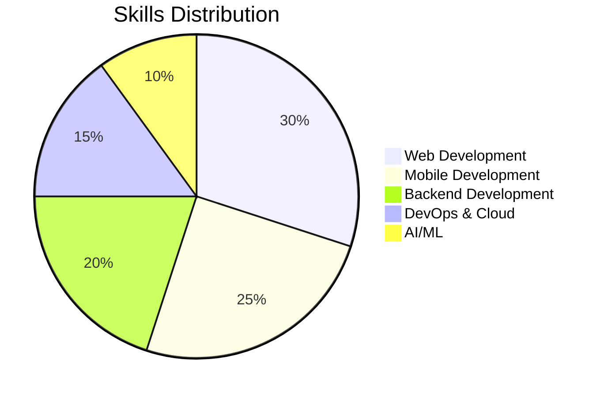
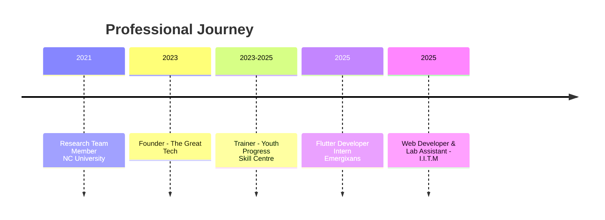

Here's an enhanced version of your README with online logos, images, and GIFs integrated using markdown:

```markdown
# MAQSOOD HUSSAIN WANI  
📍 Aripanthan, Beerwah, Budgam, J&K, India  
📞 +91 7889528326 | 📧 themaqsoodhussainwani@gmail.com  
🔗 [Portfolio](https://maqsoodhussain.github.io) | [GitHub](https://github.com/maqsoodhussain)


**Edit profile** | **Join & Interview - 2 Members** | **OK! (1) : 7:59**

---

## 👨‍💻 Maqsood Hussain Wani here

### Namaste! 🙏 I'm Maqsood Hussain Wani

#### 🎯 About Me

- **🚀 Started my journey in Software Development during my Bachelor's in Computer Applications**
  
  - I enjoy working on full-stack web and mobile applications, and exploring AI/ML in my free time.
  - Currently pursuing **Master of Computer Applications (MCA)** at University of Kashmir.

- **🛠️ Hands-on experience in Flutter, Node.js, PHP, and Python**
  
  - I have worked on real-world projects ranging from eCommerce apps to secure authentication systems.

- **❤️ Passionate about Open Source, Teaching, and Tech Communities**
  
  - I believe in learning by building and sharing knowledge with others.

---

### 📊 GitHub Stats


### 🏆 Tech Stack


---

### 📂 Top Projects

| Project | Tech Stack | Description |
|---------|------------|-------------|
| **TechHive** |   | Student community platform |
| **Ride Booking App** |   | Ride booking with authentication |
| **eCommerce App** |   | Full-featured shopping app |
| **Instagram Clone** |  | UI-focused clone application |

---

### 💬 Random Dev Quote


---

### 📈 Skillset Overview



### 🎓 Education & Certifications


---

### 💼 Experience Timeline



---

### 🌐 Let's Connect!

[](https://linkedin.com/in/maqsoodhussain)
[](https://github.com/maqsoodhussain)
[](https://maqsoodhussain.github.io)
[](mailto:themaqsoodhussainwani@gmail.com)
[](https://wa.me/917889528326)


---
